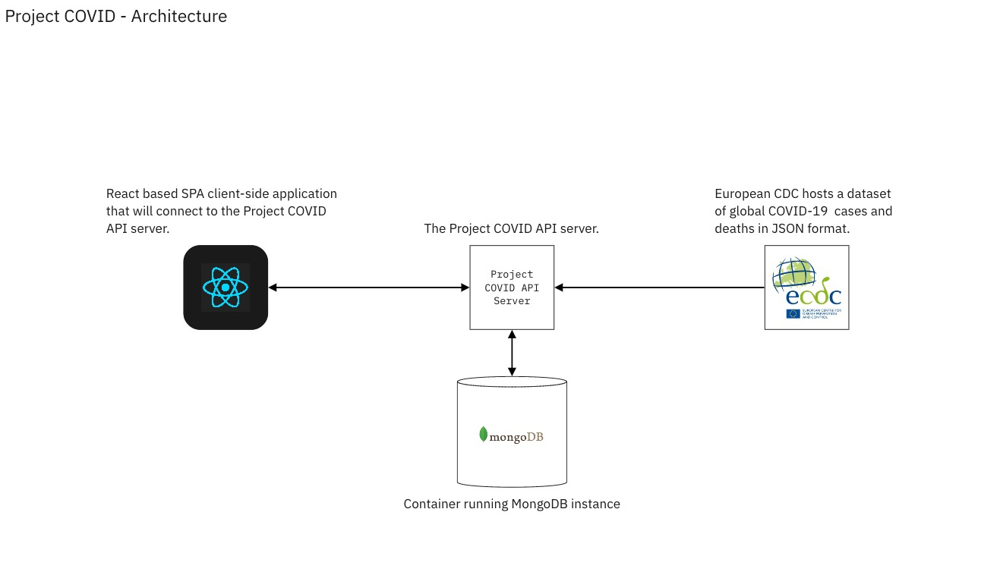
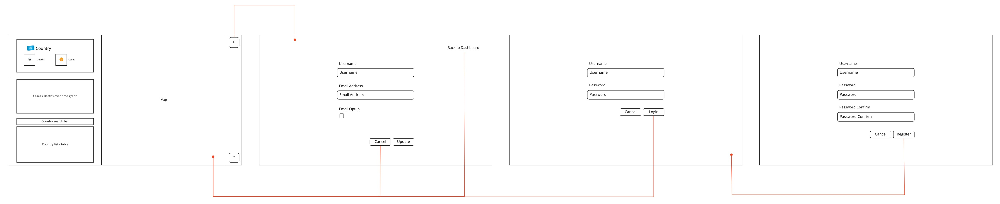

# 02 Project - COVID API

Build a COVID-19 tracker API server using daily COVID-19 summary data from the European CDC API.

**Contents**
- [02 Project - COVID API](#02-project---covid-api)
  - [Project Brief](#project-brief)
    - [Application Feature List](#application-feature-list)
    - [Architecture](#architecture)
    - [Application Prototype](#application-prototype)
    - [Project Requirements](#project-requirements)
  - [Rationale](#rationale)
  - [Getting Started](#getting-started)
  - [Project Part A - Database Setup](#project-part-a---database-setup)
  - [Project Part B - Mongoose Models](#project-part-b---mongoose-models)
  - [Project Part C - Country Summary Loader](#project-part-c---country-summary-loader)
  - [Project Part D - COVID API Routes](#project-part-d---covid-api-routes)
  - [Project Part E - Authentication Routes](#project-part-e---authentication-routes)
  - [Project Part F - Authentication Middleware](#project-part-f---authentication-middleware)
  - [Project Part G - Profile](#project-part-g---profile)
  - [Project Part H - React App](#project-part-h---react-app)
  - [Project Part I - Code Reviews](#project-part-i---code-reviews)
  - [Project Part J - Documentation](#project-part-j---documentation)
- [Submit the Project](#submit-the-project)

---

<details>
  <summary>Marking Criteria</summary>
<br>
The following Learning Outcomes are assessed using the below criteria:

<table>
  
  <tr>
    <td>LO7</td>
    <td>Write scripts/code that adheres to coding standards to implement and customise a secure solution using frameworks and libraries.</td>
    <td>1 Credit<br>(3.33%)</td>
  </tr>
  
  <tr>
    <td>LO11</td>
    <td>Select and apply multiple plug-in solutions.</td>
    <td>1 Credit<br>(3.33%)</td>
  </tr>
  
  <tr>
    <td>LO14</td>
    <td>Migrate a web solution from development to a testing environment.</td>
    <td>1 Credit<br>(3.33%)</td>
  </tr>
  
  <tr>
    <td>LO15</td>
    <td>Determine the performance of web applications using testing on multiple platforms, including a variety of devices and browsers; include integrity, speed, and considerations of user requirements.</td>
    <td>1 Credit<br>(3.33%)</td>
  </tr>

  <tr>
    <td>LO17</td>
    <td>Impliment system data to a live platform.</td>
    <td>1 Credit<br>(3.33%)</td>
  </tr>
  
  <tr>
    <td>LO20</td>
    <td>Apply communication, collaboration, teamwork, documentation, customer experience and demonstrate projects using oral and visual presentations</td>
    <td>1 Credit<br>(3.33%)</td>
  </tr>
  
  <tr>
    <td>LO22</td>
    <td>Apply professional, legal, and ethical principles and practices in a socially responsible manner as an emerging IT professional.</td>
    <td>1 Credit<br>(3.33%)</td>
  </tr>
  
  <tr>
    <td>LO26</td>
    <td>Apply systems development life cycle principles including migrating changes through environments, and determine considerations for post-launch such as monitoring conversions</td>
    <td>1 Credit<br>(3.33%)</td>
  </tr>
  
  <tr>
    <td>LO33</td>
    <td>Demonstrate advanced technical knowledge of applications for supporting user requirements.</td>
    <td>1 Credit<br>(3.33%)</td>
  </tr>
  
  <tr>
    <td colspan="2">Total credit weighting counting towards the final grade of WDD01</td>
    <td>9 Credits<br>(29.97%)</td>
  </tr>
</table>

To receive the LO credits - all summative projects must receive a C- Grade (50% or higher).

<table>
  <tr>
    <th>Project Component</th>
    <th>Acceptance criteria</th>
    <th>Mark (out of 10)</th>
    <th>Component weighting</th>
    <th>Assessment Grade</th>
  </tr>
  <tr>
    <td>Part A</td>
    <td>Meets the acceptance criteria for Part A.</td>
    <td></td>
    <td>0%</td>
    <td></td>
  </tr>
    <tr>
    <td>Part B</td>
    <td>Meets the acceptance criteria for Part B. Automated tests pass.</td>
    <td></td>
    <td>5%</td>
    <td></td>
  </tr>
    <tr>
    <td>Part C</td>
    <td>Meets the acceptance criteria for Part C.</td>
    <td></td>
    <td>0%</td>
    <td></td>
  </tr>
    <tr>
    <td>Part D</td>
    <td>Meets the acceptance criteria for Part D.</td>
    <td></td>
    <td>20%</td>
    <td></td>
  </tr>
    <tr>
    <td>Part E</td>
    <td>Meets the acceptance criteria for Part E.</td>
    <td></td>
    <td>15%</td>
    <td></td>
  </tr>
    <tr>
    <td>Part F</td>
    <td>Meets the acceptance criteria for Part F.</td>
    <td></td>
    <td>15%</td>
    <td></td>
  </tr>
    <tr>
    <td>Part G</td>
    <td>Meets the acceptance criteria for Part G.</td>
    <td></td>
    <td>10%</td>
    <td></td>
  </tr>
    <tr>
    <td>Part H</td>
    <td>Meets the acceptance criteria for Part H.</td>
    <td></td>
    <td>0%</td>
    <td></td>
  </tr>
    <tr>
    <td>Part I</td>
    <td>Meets the acceptance criteria for Part I.</td>
    <td></td>
    <td>5%</td>
    <td></td>
  </tr>
    <tr>
    <td>Part J</td>
    <td>Meets the acceptance criteria for Part J.</td>
    <td></td>
    <td>5%</td>
    <td></td>
  </tr>
  <tr>
    <td>Code quality</td>
    <td>Code looks professional and is formatted in a consistent manner. Code is easy to read and understand, with comments and well named functions and variables. No errors/bugs/syntax problems.</td>
    <td></td>
    <td>20%</td>
    <td></td>
  </tr>
  <tr>
    <td>Development process </td>
    <td>Submitted correctly in GitHub Classrooms. Includes at least one commit per project part, demonstrating progression of development. Clear commit messages.</td>
    <td></td>
    <td>5%</td>
    <td></td>
  </tr>
  <tr>
    <th colspan="2" align="left">Total grade</th>
    <td></td>
    <td>100%</td>
    <td>/100</td>
  </tr>
</table>

</details>

<details>
  <summary>Marking Scale</summary>
<br>
<table>
  <tr>
    <th>Marking Scale</th>
    <th>Descriptor</th>
  </tr>
  <tr>
    <td>10</td>
    <td>Excellent</td>
  </tr>
  <tr>
    <td>9</td>
    <td>Great</td>
  </tr>
  <tr>
    <td>8</td>
    <td>Very Good</td>
  </tr>
  <tr>
    <td>7</td>
    <td>Good</td>
  </tr>
  <tr>
    <td>6</td>
    <td>Average</td>
  </tr>
  <tr>
    <td>5</td>
    <td>Satisfactory</td>
  </tr>
  <tr>
    <td>4</td>
    <td>Some effort</td>
  </tr>
  <tr>
    <td>3</td>
    <td>Un-satisfactory</td>
  </tr>
  <tr>
    <td>2</td>
    <td>Incomplete</td>
  </tr>
  <tr>
    <td>1</td>
    <td>Poor</td>
  </tr>
  <tr>
    <td>0</td>
    <td>Did Not Complete</td>
  </tr>
</table>
  
</details>

---

## Project Brief

Your team has been tasked with building the server-side stack of a COVID-19 tracker web application.

### Application Feature List

The web application should have the following features:

1. Display the global total COVID-19 cases and deaths. This is the default view for the web application.

2. List of countries with the current total COVID-19 cases and deaths.
   
3. Allow a country to be selected from the country list, which then displays the cases and deaths for that country.
    - Selecting a country should pan and zoom to the country on the map and drop a pin with the country flag emoji and COVID-19 stats.

4. Allow users to register and log in.
    - User authentication is optional.

5. Allow users to view and update their user profiles/accounts.
    - Allow users to change their email address.

### Architecture


</img>

### Application Prototype

Prototype for the Project COVID client-side application. The API server will need to implement the RESTful API and user authentication functions that the client-side application will consume.



### Project Requirements

- The code should be documented. Add a separate markdown document, called `README_DEV.md` detailing how to install and start the project server for development purposes.

- Use branches and pull requests for your work. Pull requests require code to be reviewed and approved by fellow a teammate ***before*** merging pull requests into the `master` branch.

- Avoid committing new additions to the `master` branch directly. Additions to the project should be made in other branches (non-`master` branches), then merged into the `master` branch once the pull request has been reviewed and approved (see above).

---

## Rationale

This is the final project to test your knowledge of all the concepts that were covered during the server-side course. You will also get to use your new-found skills in a large server-side project. [GLHF](https://www.urbandictionary.com/define.php?term=glhf).

---

## Getting Started

1. Accept the project with the project link from the class notes.
2. `clone` to your local computer.
3. `cd 02-proj-covid-api--<your_team_name>`.
4. Install dependencies with `yarn install`.
5. Start the server `yarn run dev`.
6. Read the project instructions and get started.

---

## Project Part A - Database Setup

<details>
  <summary>Run MongoDB Container</summary>
  <br>

  Start a new MongoDB container for the project:

  ```shell
  # don't run with credentials!!
  docker run -d -p 27017:27017 --name covid-api-mongo \
    -v $(pwd)/data/init.d:/docker-entrypoint-initdb.d \
    mongo
  ```

  **Acceptance Criteria**: There is no unit test for this part. If you can confirm the collection was added to the database, like the image above, you should have carried out this part correctly.

</details>

## Project Part B - Mongoose Models

<details>
  <summary>Complete the Schemas</summary>
  <br>

  There are 3 resources for the API, `CountrySummary`, `Records`, and `Users`. Schema/model files for these resources are located in `src/models`.

  * The `Record` resource is the same objects returned from the European CDC API.

  * The `CountrySummary` resource is a summary of the current cases and deaths, plus additional general-purpose information about a country, like the official name, latitude/longitude, and flag emoji. The schema for this resource has already been completed.

  * The `User` resource are users that have signed up to the app via the React app.

  **Acceptance Criteria**: 

  - The `Record` schema should have the same fields and data types as the records from the ECDC API.

      - If you need to check the data from the ECDC API, use Insomnia to make a `GET` request to `https://opendata.ecdc.europa.eu/covid19/casedistribution/json`, or, check the sample dataset in `data/raw/covid-19-sample.json`.

  - The `User` schema has the following properties:
    - username
    - email
    - password
    - emailOptIn (boolean)

      - The `username` and `email` should be `required` and `unique`.
      - `password` should be `required`.
      - The `emailOptIn` property should be `Boolean` type and have the `default: false` option.

</details>

## Project Part C - Country Summary Loader

<details>
  <summary>Generate Country Summary Data</summary>
  <br>

  Make sure to have completed the mongoose models/schemas from [Part B](#project-part-b---database-setup) before attempting this part.

  Rather than calculating the totals COVID stats every time an HTTP client makes a request to the server, it would be more efficient to calculate the global and country stats periodically, when getting the latest records from the ECDC API.

  The project includes an `npm script` that will get the latest records from the ECDC API and calculate the global and country stats, then update the `CountrySummary` collection with the latest calculated results.

  All you need to do for this part is to run the script:

  ```shell
  yarn run load
  ```

  If the `CountrySummary` model has been configured correctly, the `countrySummaries` collection in the database should have a `CountrySummary` document for each country that includes the current COVID stats.

  **Acceptance Criteria**:

  - Run the `load` script (specified in `package.json`).

  - Use Robo3T to confirm there is a `countrySummaries` collection in the Mongo database.

</details>

## Project Part D - COVID API Routes

<details>
  <summary>Build the COVID API Routes</summary>
  <br>

  The `load` script from [Part C](#project-part-c---country-summary-loader) takes care of creating and updating the `Record` and `CountrySummary` collections in the database, so the API server only needs to serve the data via a few `GET` routes.

  **Acceptance Criteria**:

  - **GET** `/api/records/summaries` - Return an array of `CountrySummary` objects.

  - **GET** `/api/records/summaries/:geoId` - Return a single `CountrySummary` object selected by `geoId`.

  - **GET** `/api/records/` - Return an array of `Record` objects.

  - **GET** `/api/records/:geoId` - Return an array `Record` objects selected by `geoId`.

</details>

## Project Part E - Authentication Routes

<details>
  <summary>Build the Authentication Routes</summary>
  <br>

  Add basic authentication functionality to the API server.

  **Acceptance Criteria**:

  1. Register User: `POST` request to the `/auth/register` route with a request body object containing a `username` and `password` should create a new user.

      - ***Use the [Argon2 algorithm/module](https://github.com/ranisalt/node-argon2) to encrypt the password***.

      - **On success**: Return status `200` and `{ success: 'New user registered' }`.

      - **On error (user already exists)**: Return status `400` and `{ error: 'Username taken' }`.

      - **On error (`req.body` missing username, email, or password)**: Return status `400` and `{ error: 'Username, Email, Password required' }`.

  2. Login User: `POST` request to the `/auth/login` route with a request body object containing a `username` and `password` should authenticate the user and return a JWT token.

      - **On success**: Return status `200` and following response object:

        ```
        { success: 'User authenticated', token: <jwt_token> }
        ```

      - The JWT token should contain the following payload:

        ```js
        {
          sub: <username>,
          iss: 'covid-api-server',
          optIn: <user_emailOptIn>
        }
        ```

      - **On error (`req.body` missing username or password)**: Return status `400` and `{ error: 'Username and password required' }`.

      - **On error (user not found)**: Return status `404` and `{ error: 'User not found' }`.

      - **On error (incorrect password)**: Return status `401` and `{ error: 'Incorrect password' }`.

</details>

## Project Part F - Authentication Middleware

<details>
  <summary>Build the Authentication Middleware</summary>
  <br>

  Build authentication middleware to protect the profiles page.

  **Acceptance Criteria**: The `requireAuth` middleware function should do the following:

  - Requests without an `authorization` header should fail.

  - Requests with incorrect `Bearer <jwt_token>` string in the `authorization` header should fail.

  - Requests with invalid JWT token should fail.

  - All failed requests should return a status `401` and an appropriate error message or object containing an error property and message.

  - Call the `next()` function.

</details>

## Project Part G - Profile

<details>
  <summary>Build Profile Routes</summary>
  <br>

  The `profiles` routes allow the API server to send data about the authenticated user to the HTTP client, or allows the user profile (`User` model) to get updated via the API.

  **Acceptance Criteria**:

  - **GET** `/api/profiles/:username` - Return a `User` object selected by `userId`.

  - **PATCH** `/api/profiles/:username` - Updates a `User` object with the request body properties and returns the updated `User` object.

    - The route handler only needs to be able to update the `req.body.emailOptIn` property.

  - Both routes (above) require should be secured with the `requireAuth` middleware from [Part G](#project-part-g---authentication-middleware).

</details>

## Project Part H - React App

<details>
  <summary>Use API with the React App</summary>
  <br>

  There is a React application that is designed to work with this API server. Once the API server is built, the React app should work properly by using the COVID API and authentication routes.

  **Acceptance Criteria**: The [React app](https://github.com/Developers-Institute/project-covid-app) works with the project server.

</details>

## Project Part I - Code Reviews

<details>
  <summary>Perform Code Reviews</summary>
  <br>

  Ensure all the project pull requests have been peer-reviewed by at least one other team member, as per the [Project Requirements](#project-requirements).

  **Acceptance Criteria**: Pull requests in GitHub have been approved by a reviewer.

</details>

## Project Part J - Documentation

<details>
  <summary>Write Server Documentation</summary>
  <br>

  Create a `README_DEV.md` file. Add an overview of the server and instructions for a developer audience on how to start the server and run the unit tests. See the `create-react-app` README for inspiration: https://github.com/facebook/create-react-app/blob/master/README.md

  It may be a really good idea to include the instructions for starting and connecting the React app to the server too.

  Create a `Contributors.md` file and add the name (or GitHub username) and optionally the email address, for each team member working on the project.

  **Acceptance Criteria**:

  - `README_DEV.md` file created in the project.

  - Correct instructions are included in the `README_DEV.md` file for starting the API server.

</details>

---

# Submit the Project

Submissions for this project are tracked through GitHub classroom. When you `push` code to the repo it will run any tests on your submitted code and give you a result.

You can check the Autograder logs and results in the project repo, under the `Actions` tab.

Your project repos can be found here: https://github.com/Developers-Institute-Classrooms

---

<details>
  <summary>
    Git CLI Refresher
  </summary>

If you need help remembering what commands to type with `git`, use the following as a reference, or watch the [git walkthrough tutorial video](https://vimeo.com/433825571/bc1830fb90)

```shell
# when ready to commit and push
git add .

git commit -m "Completed Part A"

git push origin master
```

</details>
